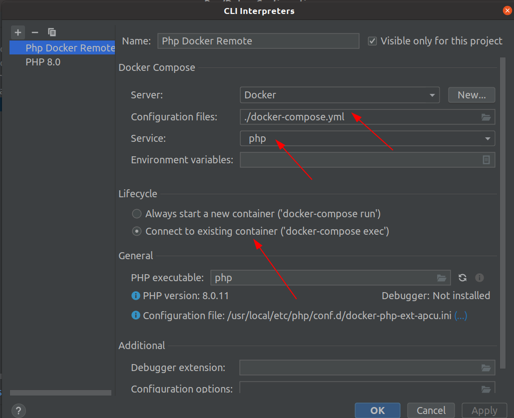
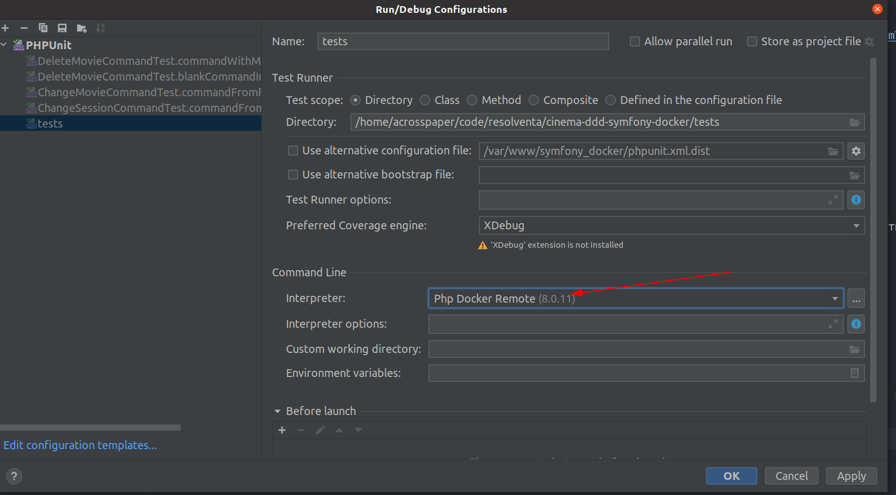
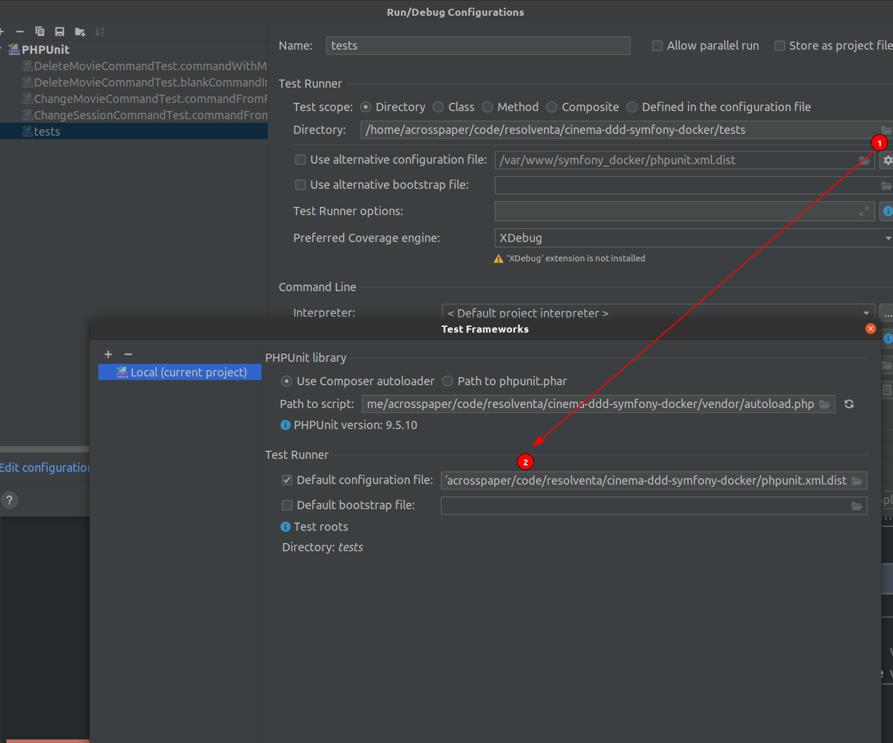

# Инструкция по развертыванию приложения

``docker-compose up -d --build``

Из корневой директории проекта соберет все контейнеры, необходимые для работы приложения Установка зависимостей
происходит следующей командой

`` docker-compose exec php composer install ``

Установит необходимые для работы проекта Composer зависимости

``docker-compose exec php bin/console make:migration``

Применит миграции на вашу базу данных, которая заранее уже была создана внутри контейнера database под именем dev
docker-compose.yml

# Настройки

Если вы хотите поменять хост, порт, или имя базы данных, то можно это сделать через .env файл в корне директории app

Используется php-fpm + nginx + mysql Настройки для подключения БД можно посмотреть в [файле](docker-compose.yml)
Настройки nginx доступны по [ссылке](docker/nginx/default.conf)
Для контейнера php уже настроена рабочая категория на проект с Симфони

Запуск зависимостей и cli инструментов symfony делается через контейнер php

`` docker-compose exec php /bin/bash whoami ``

`` docker-compose exec php bin/console make:controller ``

Порт mysql проброшен с контейнера database на localhost:3306. К нему можно подключиться инструментом для работы с БД
вроде datagrip

Схема база данных представлена на скриншоте ниже

# Тестирование

## Подготовка тестовой среды

1. Создадим тестовую базу данных

``docker-compose exec php bin/console doctrine:database:create --env=test``

Обратите внимание, что новое имя базы данных будет такое же, как указано в докере, но с суффиксом _test (dev_test)

2. Установим фикстуры

``docker-compose exec php bin/console doctrine:fixtures:load --env=test``

База данных готова для тестирования

## Настройка IDE

Для тестирования приложения настроена тестовая среда. Если вы хотите, чтобы тесты запустились с Конфигуратора Phpstorm
Run, то убедитесь, что у вас правильно настроен удаленный php интерпретатор

Теперь вы сможете запускать тесты с phpstorm, нажав ПКМ по директории tests. Тесты будут запущены с учетов конфигурации
из [phpunit.xml.dist](phpunit.xml.dist) внутри докер контейнера.

Если вы хотите запустить тесты из консоли, то наберите команду

``docker-compose exec php ./vendor/bin/phpunit`
