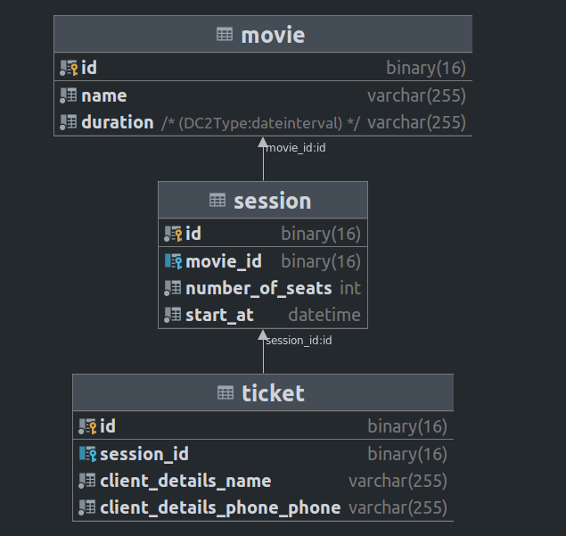

# Инструкция по развертыванию приложения

``docker-compose up -d --build``
Из корневой директории проекта соберет все контейнеры, необходимые для работы приложения Установка зависимостей
происходит следующей командой

`` docker-compose exec composer install ``
Установит необходимые для работы проекта Composer зависимости

``docker-compose exec bin/console make:migration``
Применит миграции на вашу базу данных, которая заранее уже была создана внутри контейнера database под именем dev
docker-compose.yml

Приложение будет доступно по [адресу](localhost:8080)

# Настройки

Если вы хотите поменять хост, порт, или имя базы данных, то можно это сделать через .env файл в корне директории app

Используется php-fpm + nginx + mysql Настройки для подключения БД можно посмотреть в [файле](docker-compose.yml)
Настройки nginx доступны по [ссылке](docker/nginx/default.conf)
Для контейнера php уже настроена рабочая категория на проект с Симфони

Запуск зависимостей и cli инструментов symfony делается через контейнер php
`` docker-compose exec php /bin/bash whoami ``

`` docker-compose exec bin/console make:controller ``

Порт mysql проброшен с контейнера database на localhost:3306. К нему можно подключиться инструментом для работы с БД
вроде datagrip

Внутри [директории](mysql-backup) есть бэкап примера БД кинотеатра. Его можно развернуть через datagrip или любым другим
удобным инструментом.

Схема база данных представлена на скриншоте ниже

